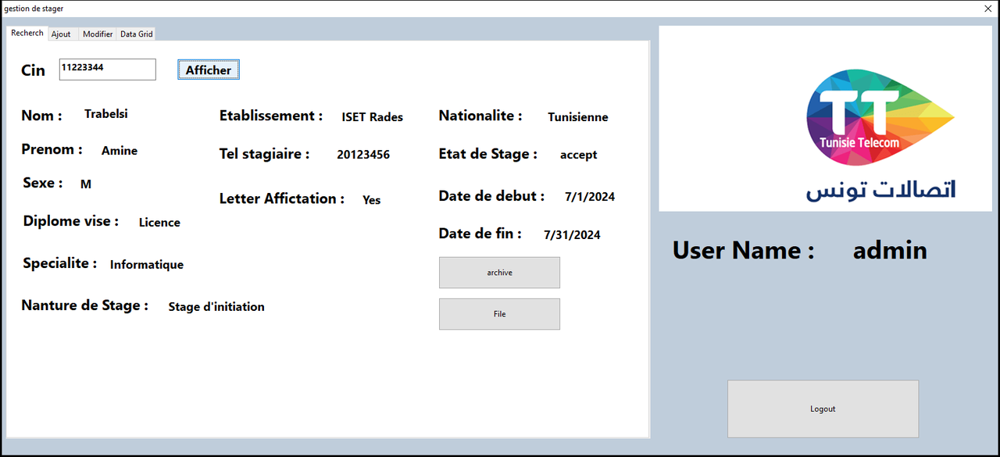
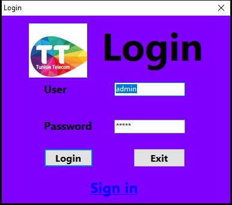
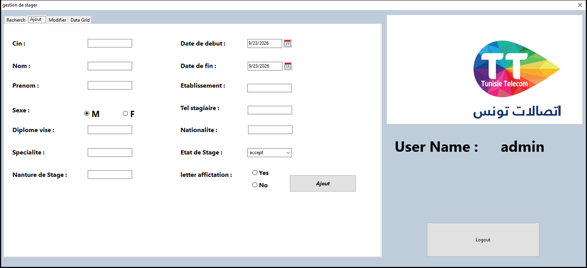
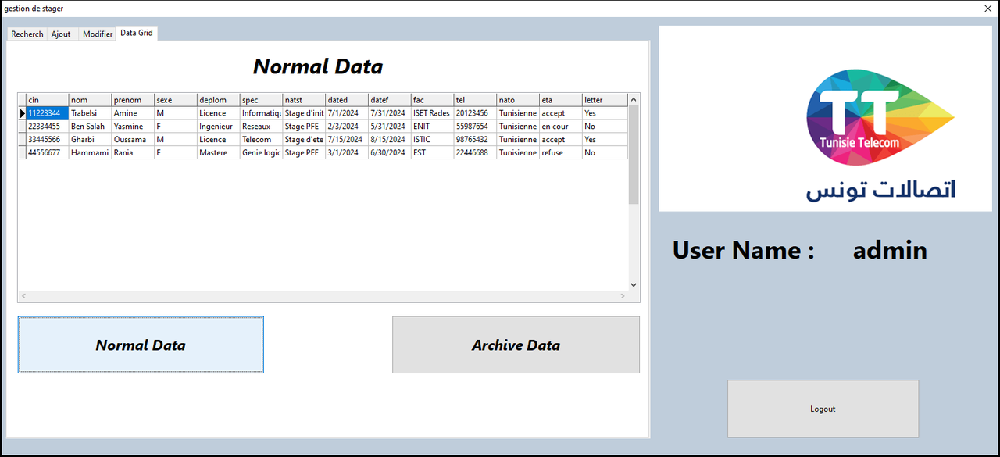

# Employer-Manager: intern management desktop app (Tunisie Telecom internship)

A Windows desktop application to register and track **interns (*stagiaires*)** in a company, built with **Lazarus / Free Pascal** and an embedded **SQLite** database. I built it during my internship at **Tunisie Telecom**. HR staff had been tracking intern files on paper or in Excel, and the goal was to replace that with a small searchable database app.

The interface is in French, like the working environment it was built for (*Recherche*, *Ajout*, *Modifier*...).



| Login | Add an intern (*Ajout*) |
| --- | --- |
|  |  |



*Screenshots: the included `project1.exe` running on Windows 10, with fictional demo interns inserted into a copy of `base.db`.*

---

## Features

Everything below comes from the source code in this repository (`unit1.pas` to `unit4.pas`).

- **Login screen** (`unit1`): checks the user name and password against a `users` table in SQLite.
- **User accounts** (`unit3`, `unit4`): a *Sign in* window to create a user, and a *Show All Users* window with a data grid and navigator.
- **Intern records** (`unit2`, main window *gestion de stager*). Each intern is identified by their national ID card number (**CIN**) and stores: last and first name, sex, target degree, specialty, school/university, phone, nationality, internship type, start and end dates, status (`accept` / `refuse` / `en cour`), and whether an assignment letter was issued.
  - **Recherche**: look up an intern by CIN and display the full record.
  - **Ajout**: add an intern (form with date pickers, radio buttons and a status drop-down). Adding a CIN that already exists is rejected.
  - **Modifier**: load an intern by CIN, edit any field and save.
  - **Data Grid**: list all current interns (*Normal Data*) or archived ones (*Archive Data*) in a `TDBGrid`.
  - **Archive**: move an intern from the active table to the archive table (`stage` → `stagearch`).
  - **File**: export the displayed record to a plain-text file (`stage.txt`).
- **Schema bootstrap**: the app creates its tables (`users`, `stage`, `stagearch`) with `CREATE TABLE` statements if the database file is missing.

### Database schema

```
users      (user PK, pass)
stage      (cin PK, nom, prenom, sexe, deplom, spec, natst, dated, datef,
            fac, tel, nato, eta, letter)
stagearch  (same columns as stage: archived interns)
```

## Tech stack

- **Language / IDE:** Free Pascal (Object Pascal, `objfpc` mode) with **Lazarus** (forms saved with LCL 2.2.4)
- **UI:** LCL forms: `TPageControl`, `TDBGrid`, `TDBNavigator`, `TDateEdit`
- **Database:** **SQLite 3** through Lazarus SQLdb (`TSQLite3Connection`, `TSQLTransaction`, `TSQLQuery`) using parameterized `INSERT`/`UPDATE` queries; `SQLite3.dll` (64-bit) ships next to the executable
- **PowerPDF** (third-party, LGPL, by Takezou): a Lazarus component package for generating PDF files. Its source (`PReport.pas`, `PdfDoc.pas`, ...) and examples are included, and the project depends on the `pack_powerpdf` package. **PDF export is not finished**: the PowerPDF report code in `Button10Click` is commented out, so the *File* button writes a text file instead.

## Build and run

### Just run it (Windows 64-bit)

`project1.exe`, `SQLite3.dll` and `base.db` must be in the same folder. Start `project1.exe` from that folder.

`base.db` ships with the schema and two test accounts (`test` / `test`). Keep this file: if it is missing, the first form to start creates only the `users` table, and the check that should create the intern tables then finds an existing file and skips them.

### Build from source with Lazarus

1. Install [Lazarus](https://www.lazarus-ide.org/) (2.2 or newer, 64-bit Windows).
2. Install the PowerPDF package: **Package → Open Package File (.lpk)** → `pack_powerpdf.lpk` → **Compile** → **Use → Install**, then let Lazarus rebuild and restart.
3. Open `project1.lpi` and press **Run → Build** (Shift+F9), or **Run** (F9).
4. Copy `SQLite3.dll` and `base.db` next to the produced `project1.exe` if they are not already there.

Compiled units go to `lib/<cpu>-<os>/`, which is git-ignored.

## Project structure

```
.
├── project1.lpi / .lpr / .res / .ico   # Lazarus project (app title: "stage record")
├── unit1.pas / .lfm     # Login form
├── unit2.pas / .lfm     # Main window: search, add, edit, data grid, archive, text export
├── unit3.pas / .lfm     # Create user form
├── unit4.pas / .lfm     # List all users
├── base.db              # SQLite database (schema + test accounts)
├── SQLite3.dll          # SQLite runtime (x64)
├── project1.exe         # prebuilt Windows x64 binary
├── backup/              # Lazarus automatic backups of the units
├── pack_powerpdf.*, P*.pas, Pdf*.pas, PowerPdf.*, xpm/   # vendored PowerPDF package (LGPL, see lgpl.txt)
├── Example/, LazarusExamples/, PowerPdfRef.pdf, PowerPDF.zip  # PowerPDF samples and reference
└── docs/screenshots/    # README images
```

The requirements came from a specification provided by Tunisie Telecom; all of the application code in this repository was written by me during the internship.

## Known limitations

This was an early learning project, and these are the weak points I would fix first:

- **Security:** passwords are stored in plain text; the user name `admin` is accepted with any password, and so are empty user and password fields (an unknown user returns empty values that match); the login, search, archive and update `WHERE` clauses concatenate user input into SQL (injection risk). They should use parameters like the `INSERT` queries do; and the *Sign in* window (create user) can be opened from the login screen without being logged in.
- **Archive bug:** when a record is archived, the phone, nationality and status columns are filled from the wrong labels (first name, sex and degree).
- **Edit bug:** saving the status "refuse" in *Modifier* reads the drop-down of the *Ajout* tab instead of its own.
- **Dates:** dates are saved as locale-formatted text, so they can read back as `30/12/1899` (visible in `stage.txt`).
- The UI has French labels with a few typos (*Nanture*, *Affictation*), and PDF export is unfinished (see above).

## License

No license has been chosen for the application code yet. The bundled PowerPDF component is distributed under the GNU LGPL (`lgpl.txt`).
